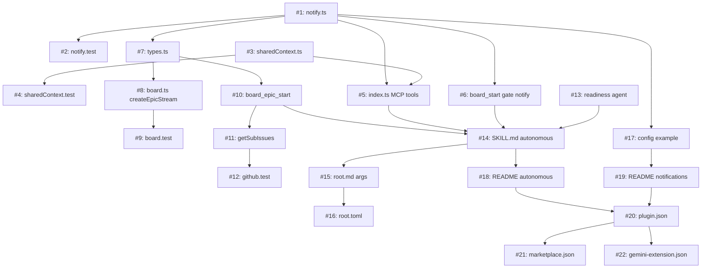

# Implementation Plan: Autonomous Multi-Issue Execution

## Context & Motivation

Root today works one issue at a time. The user kicks off `/root #N`, Root produces a plan, runs implementation in subagents, and ships a PR. This is the right shape when each issue is non-trivial — the per-issue PR carries a useful audit trail of intent → plan → diff → review.

It's the wrong shape for two recurring patterns we hit constantly:

1. **Working through an epic.** An epic groups related child issues; we want Root to march through them in one autonomous pass. Per-issue PRs in this case are noise, since the meaningful unit of review is the epic itself.
2. **Sweeping cleanup batches.** Several small tier-2 fixes (UI tweaks, lint nits, copy edits) where the per-issue PR ceremony costs more than the work itself. Each PR triggers full CI, full review process — wasted overhead for changes that take five minutes to verify together.

Both patterns share the same machinery (one branch, many subagents, one PR, persistent context across issues) with different inputs. This plan introduces that machinery as a single coherent feature in Root 2.4, alongside the supporting primitives required to make autonomous mode safe: a readiness gate so we don't run on under-specified issues, a shared-context store that survives auto-compaction, and a Discord notification surface so we know when Root is parked.

This is also the watershed where Root commits to its identity as a BrandCast-internal tool: design choices favor BrandCast's ecosystem-of-repos / single-org-Project topology, and we stop hedging for hypothetical other consumers.

## Scope

**In scope:**
- Discord notifications for human gates, blockers, completions
- Issue readiness grader (pre-flight rubric) with a hard-stop output
- Shared-context primitives in the board MCP (`board_shared_*` tools + on-disk file)
- Epic mode: `/root #<epic> --auto` runs through child issues sequentially, one PR per epic
- Batch mode: `/root #x #y #z --auto --batch` runs through an explicit list, all-tier-2 enforced, one PR per batch
- Partial-PR semantics: completed children ship; failed/unrun children surface to the user
- Documentation update reflecting the autonomous flows
- Version bump 2.3.3 → 2.4.0 across plugin/marketplace/gemini extension

**Out of scope:**
- Within-epic parallelism (independent children running in parallel subagents) — deferred; needs the executor seam from the Scion epic, which is now backlog
- Webhook ingress / HTTP Root service — separate Root 3.0 concern
- Cross-epic resumption (resume an epic that was killed mid-run) — possible future, not v1
- Auto-decomposing issues that don't have child issues already linked
- Custom event types beyond the four-event taxonomy in REQ-005 — extensible later
- Slack / email / SMS notifiers — Discord only for v1

## Requirements Traceability

| Req ID | Description | Priority | Affected Files |
|--------|-------------|----------|----------------|
| REQ-001 | `/root #<epic> --auto` runs through all linked child issues sequentially, accumulating commits onto a single epic branch and a single PR | P0 | `skills/root/SKILL.md`, `mcp/mcp-root-board/src/index.ts`, `mcp/mcp-root-board/src/board.ts` |
| REQ-002 | `/root #x #y #z --auto --batch` runs through an explicit issue list with the same machinery; rejects any tier-1 classification | P0 | `skills/root/SKILL.md`, `mcp/mcp-root-board/src/index.ts` |
| REQ-003 | Readiness grader runs before stream creation in autonomous mode (against the epic itself AND every child). On any `needs-clarification` verdict, Root enters an interactive interview using the grader's questions, applies user answers to the issue body via `gh issue edit`, and re-grades. Loop until `ready` or user aborts. **No bypass flag** — closing the readiness gap is the work; we don't power through it. | P0 | `agents/issue-readiness-grader.md`, `skills/root/SKILL.md` |
| REQ-004 | Shared-context store persists per-epic / per-batch across subagent boundaries and survives auto-compaction of the orchestrator harness | P0 | `mcp/mcp-root-board/src/sharedContext.ts`, `mcp/mcp-root-board/src/index.ts` |
| REQ-005 | Discord notifier fires on the four-event taxonomy (`blocker`, `human_gate`, `pr_ready`, `epic_complete`) when configured; absent config = silent feature off | P0 | `mcp/mcp-root-board/src/notify.ts`, `mcp/mcp-root-board/src/index.ts`, `root.config.example.json` |
| REQ-006 | Each child issue still gets a Project v2 status transition (`In Progress` on dispatch, native PR-linked → Review on PR open, native item-closed → Done on merge) | P0 | (already implemented in #8 — verified, not modified) |
| REQ-007 | Failure mid-epic ships completed children in a partial PR with a clear "incomplete" callout in the PR body and a `blocker` Discord notification | P0 | `mcp/mcp-root-board/src/index.ts`, `mcp/mcp-root-board/src/board.ts` |
| REQ-008 | Notification webhook URL comes from `ROOT_DISCORD_WEBHOOK_URL` env var, not from any committed file. Optional `notifications.discord.mention` config supplies an at-mention prefix; default is no mention | P0 | `mcp/mcp-root-board/src/notify.ts`, `root.config.example.json`, `README.md` |
| REQ-009 | Stream state machine and existing gates apply per child issue inside autonomous mode; `human` gates cause an autonomous run to park (with notification) instead of bypassing | P0 | `mcp/mcp-root-board/src/gates.ts`, `mcp/mcp-root-board/src/index.ts` |
| REQ-010 | Documentation in README explains autonomous mode, readiness rubric, notification setup, and partial-PR semantics | P1 | `README.md`, `commands/root/` |
| REQ-011 | Plugin/marketplace/gemini-extension versions all bumped to 2.4.0 in lockstep | P0 | `.claude-plugin/plugin.json`, `.claude-plugin/marketplace.json`, `gemini-extension.json` |

_Every file in the Change Manifest maps to at least one requirement. Every P0 requirement maps to at least one file._

## Architecture Decisions

A few decisions worth calling out explicitly because they shape every subsequent design choice:

**Subagent-per-issue, not subagent-per-epic.** The orchestrator harness stays in a single conversation; each child issue spawns a Claude `Agent` tool call with `isolation: worktree`. This protects the orchestrator's context window and gives natural failure isolation. The orchestrator's only job is sequencing, gate evaluation, shared-context curation, and notification.

**Single epic branch, no per-issue branches.** Branch is `feat/epic-<epic-id>-<slug>` (or `chore/batch-<date>` for batch). Each child subagent commits directly onto this branch in its worktree. PR is opened on first child completion and updated thereafter. The PR body uses `Closes #x` per child, so GitHub's native "PR linked to issue" workflow fires the Project v2 → Review transition for each child automatically.

**Shared-context is append-only markdown on disk.** Lives at `.root/streams/<epic-issue-number>/shared-context.md`. Append-only because the design constraint is auto-compact survival — every load-bearing fact for resuming the epic must be on disk, not in the conversation. Bounded at 32KB (configurable); over-cap triggers a `notify(blocker)` rather than silent truncation, since loss-of-context bugs are nightmarish.

**Autonomous mode is opt-in via `--auto`, never default.** Even a perfectly-graded issue still requires an explicit `--auto` flag to skip human gates. This is not a "safe default" — it's a deliberate choice to make autonomous behavior visible at the call site.

**Readiness gate is an agent, not a hardcoded rule.** A small specialist (`issue-readiness-grader`) reads the issue body and acceptance criteria and produces a structured verdict. Implemented as an agent rather than a programmatic rule because the rubric (clarity, scope, solvability) is genuinely judgment-laden — exactly the work LLMs do well. Agent vs. skill choice: agent, because we want isolation from the orchestrator's context and a clean structured return shape.

**Failure mode is interview, not bypass.** When the grader returns `needs-clarification`, Root does NOT offer a `--force` flag or a verdict-shape override. Instead, the orchestrator enters an interactive interview using the grader's `questions` array: asks the user, captures answers, appends a structured "Clarifications" section to the issue body via `gh issue edit`, and re-invokes the grader. Loop until `ready` or the user explicitly aborts. The cap is 3 grading rounds — beyond that, the rubric or the issue is broken in a way an interview can't fix, and Root surfaces a hard stop. This makes "close the readiness gap" the work, not an obstacle to be skipped. The user can always abort to do the gap-closing on their own time, but there's no mechanism to bypass the rubric and run anyway.

**Issue body is the contract; PRDs are not consulted by the grader in v1.** Many issues are sufficient on their own. Where they aren't, the interview loop above is how we get there. PRD-aware grading is a v2 consideration if we observe v1 false-rejects on issues with full context in linked PRDs.

**Partial-PR over park-on-failure.** When child #3 of 5 fails, we ship #1-#2 in the PR and surface #3-#5 as blockers. Don't hold completed work hostage for downstream failures. The PR body marks the partial-completion clearly, and the user can re-run the unfinished issues on a follow-up.

## Change Manifest

| # | File | Action | Section / Function | Description | Reqs | Group | Status |
|---|------|--------|--------------------|-------------|------|-------|--------|
| 1 | `mcp/mcp-root-board/src/notify.ts` | create | `loadNotificationConfig()`, `sendDiscord(event, payload)`, `NOTIFICATION_EVENTS` | New module. Reads webhook URL from `ROOT_DISCORD_WEBHOOK_URL` env var. `loadNotificationConfig(rootDir)` returns parsed `notifications.discord` block from `root.config.json` or `null` (feature off). `sendDiscord(event, payload)` POSTs a Discord embed via `fetch`; embeds match the brandcast build-failure visual format (color-coded by event type, title, link, description, fields). All failures non-fatal: caught and logged to stderr, never thrown. Type definitions for `NotificationEvent = 'blocker' \| 'human_gate' \| 'pr_ready' \| 'epic_complete'` and `NotificationPayload` interface. | REQ-005, REQ-008 | A | [x] |
| 2 | `mcp/mcp-root-board/src/__tests__/notify.test.ts` | create | All cases | Mock `fetch`. Test: feature-off when env var absent, feature-off when config section absent, payload shape per event type, swallows fetch errors, includes `mention` prefix when configured, omits when not. | REQ-005, REQ-008 | A | [x] |
| 3 | `mcp/mcp-root-board/src/sharedContext.ts` | create | `getSharedContext(rootDir, epicIssue)`, `appendSharedContext(rootDir, epicIssue, note)`, `SHARED_CONTEXT_MAX_BYTES = 32768` | New module. Manages `.root/streams/<epic>/shared-context.md`. `getSharedContext` returns full file content as string (empty string if file missing). `appendSharedContext` appends a timestamped note; if the resulting file exceeds `SHARED_CONTEXT_MAX_BYTES`, returns a `{ overflow: true }` signal so the caller can fire a blocker notification rather than silently truncating. File creation creates parent directory if missing. | REQ-004 | A | [x] |
| 4 | `mcp/mcp-root-board/src/__tests__/sharedContext.test.ts` | create | All cases | Test: get returns empty string when missing, append creates file + parent dir, append round-trips through get, overflow signal fires at threshold. Use tmpdir per test. | REQ-004 | A | [x] |
| 5 | `mcp/mcp-root-board/src/index.ts` | modify | New tool registrations after `board_status` | Register two new MCP tools: `board_shared_get({ epicIssue })` calls `getSharedContext`, returns the markdown. `board_shared_append({ epicIssue, note })` calls `appendSharedContext`; on overflow fires `sendDiscord('blocker', ...)` and returns `{ overflow: true }` to the caller. | REQ-004 | A | [x] |
| 6 | `mcp/mcp-root-board/src/index.ts` | modify | `board_start` Project-sync block | Group A scope: fire `sendDiscord('human_gate', ...)` when a tier-1 stream is created without `autoApprove` (plan_approval gate will pause). Batch tier-1 rejection fires from #14 once batch mode lands. Refactored 3 existing swallow sites + 1 new mirror-label site to use `nonFatal()` helper. | REQ-005, REQ-009 | A | [x] |
| 7 | `mcp/mcp-root-board/src/types.ts` | modify | `Stream` interface | Add optional fields: `kind?: 'issue' \| 'epic' \| 'batch'` (default `'issue'`), `epicChildren?: number[]` (populated for epic/batch streams), `epicBranch?: string`. Update `StreamStatus` to include new states `'epic-running'`, `'epic-blocked'`, `'epic-complete'`, `'epic-partial'` (only valid when `kind !== 'issue'`). | REQ-001, REQ-002, REQ-007 | B | [ ] |
| 8 | `mcp/mcp-root-board/src/board.ts` | modify | `createStream`, new `createEpicStream(parentIssue, kind, children)` | Add `createEpicStream` factory that creates a stream with `kind: 'epic' \| 'batch'`, populates `epicChildren`, derives `epicBranch` from epic-issue title slug. Existing `createStream` signature unchanged for back-compat. | REQ-001, REQ-002 | B | [ ] |
| 9 | `mcp/mcp-root-board/src/__tests__/board.test.ts` | modify | New describe block `createEpicStream` | Test: epic stream record has correct kind/children/branch fields, batch kind variant, parent-child cross-linking writes parent's `childIssues` array. | REQ-001, REQ-002 | B | [ ] |
| 10 | `mcp/mcp-root-board/src/index.ts` | modify | New tool `board_epic_start` | Registers `board_epic_start({ epicIssue, mode: 'epic' \| 'batch', children?: number[], autoApprove })`. For `mode: 'epic'`, fetches sub-issues via the GraphQL `subIssues` connection on the parent. For `mode: 'batch'`, uses the explicit `children` array. Creates the epic stream, creates the epic worktree once, returns the stream record. Does NOT execute children — that's the orchestrator's job. | REQ-001, REQ-002 | B | [ ] |
| 11 | `mcp/mcp-root-board/src/github.ts` | modify | New `getSubIssues(parentIssue): number[]` | GraphQL query against the parent issue's `subIssues(first: 100)` connection. Returns child issue numbers in declared order. Throws on auth failure (non-recoverable for epic mode, unlike Project sync). | REQ-001 | B | [ ] |
| 12 | `mcp/mcp-root-board/src/__tests__/github.test.ts` | modify | New describe block `getSubIssues` | Mock `gh api graphql` with realistic sub-issues payload; assert child numbers extracted in order. | REQ-001 | B | [ ] |
| 13 | `agents/issue-readiness-grader.md` | create | Full agent template | New specialist agent. Reads issue body + acceptance criteria + labels (NOT the linked PRD — v1 issue-body-only). Outputs strict JSON: `{ "verdict": "ready" \| "needs-clarification", "confidence": 0..1, "concerns": string[], "questions": string[] }`. Rubric: acceptance criteria present, scope bounded (no "TBD" / "later"), solvability (no unresolved decisions in body), referenced files exist. Returns `needs-clarification` if any rubric item fails; `concerns` lists which, `questions` are concrete questions for the interview loop. Questions must be answerable in 1-2 sentences each — no open-ended essays. | REQ-003 | C | [ ] |
| 14 | `skills/root/SKILL.md` | modify | New "Autonomous mode" section after the issue-status-labels section | Add orchestration logic: when `--auto` is supplied, before `board_start` invoke `issue-readiness-grader` agent on the epic AND every child. On `needs-clarification`: enter interview loop — print concerns, ask each question, capture answer, append a `## Clarifications (added by /root readiness gate)` section to the issue body via `gh issue edit --body`, re-invoke grader, loop. Cap at 3 rounds; on round 4 hard-stop and instruct the user to revise the issue manually. On `ready` for all targets, proceed. Document the per-child orchestration: dispatch subagent → wait → `board_shared_append` summary → update PR body checkbox → next. On any child failure: stop, fire blocker notification, ship partial PR (still draft). | REQ-001, REQ-002, REQ-003, REQ-007, REQ-009 | C | [ ] |
| 15 | `commands/root/root.md` | modify | Argument parsing | Recognize `--auto`, `--batch`, and multi-issue invocation `/root #x #y #z`. Multi-issue without `--batch` is an error. `--batch` requires `--auto` (batch mode without auto is meaningless). | REQ-001, REQ-002 | C | [ ] |
| 16 | `commands/root/root.toml` | modify | Description / examples | Update description to mention autonomous, epic, and batch modes with example invocations. | REQ-010 | C | [ ] |
| 17 | `root.config.example.json` | modify | New `notifications` section | Add `"notifications": { "discord": { "enabled": true, "events": ["blocker","human_gate","pr_ready","epic_complete"], "mention": null } }` with a `_comment` field explaining `ROOT_DISCORD_WEBHOOK_URL` env var. | REQ-005, REQ-008 | C | [ ] |
| 18 | `README.md` | modify | New "Autonomous mode" section after "Two-Tier Workflow" | Document `/root #<epic> --auto`, `/root #x #y #z --auto --batch`, the readiness grader's verdict shape, partial-PR semantics, and Discord setup. | REQ-010 | C | [ ] |
| 19 | `README.md` | modify | New "Notifications" subsection under "Configuration" | Document `notifications.discord` config + the `ROOT_DISCORD_WEBHOOK_URL` env var. Include a curl-based verification snippet. | REQ-008, REQ-010 | C | [ ] |
| 20 | `.claude-plugin/plugin.json` | modify | `version` | `"2.3.3"` → `"2.4.0"`. | REQ-011 | D | [ ] |
| 21 | `.claude-plugin/marketplace.json` | modify | `plugins[0].version` | `"2.3.3"` → `"2.4.0"`. | REQ-011 | D | [ ] |
| 22 | `gemini-extension.json` | modify | `version` | `"2.3.3"` → `"2.4.0"`. | REQ-011 | D | [ ] |

_Action: `create` | `modify` | `delete`. Group: letter matching Execution Groups below. Status updated by `/root:impl`: `[ ]` pending, `[~]` in progress, `[x] (<sha>)` complete._

## Dependency Graph

_Solid arrows = hard dependency (must complete first). Numbers reference the Change Manifest. Groups A → B → C → D execute in roughly this order; some intra-group parallelism is fine._

## Execution Groups

### Group A: Notification + shared-context primitives

**Agent**: `team-implementer` (board MCP work; no special domain)
**Changes**: #1, #2, #3, #4, #5, #6
**Sequence**: #1 + #3 in parallel (independent modules), then their tests #2 + #4, then #5 (MCP tools wiring) and #6 (board_start gate notifications) in parallel.
**Tests**: New test files #2 and #4 must achieve the same coverage shape as `gates.test.ts` and `github.test.ts` — happy path, feature-off path, error paths, edge cases (overflow for #3, missing env var for #1).
**Verification**: `npx jest` green, `npx tsc --noEmit` clean. Manual smoke: `node -e` snippet that calls `sendDiscord` against a real test webhook in `#root-test`, observe the embed renders correctly.

### Group B: Stream / board model for epics + batches

**Agent**: `team-implementer`
**Changes**: #7, #8, #9, #10, #11, #12
**Sequence**: #7 (types) → #8 (board) → #9 (test). #11 + #12 in parallel with that. #10 needs both #8 and #11.
**Tests**: Existing board tests must still pass. New `createEpicStream` cases. New `getSubIssues` GraphQL mock test. Add an integration test that calls `board_epic_start` end-to-end against mocked `gh` and verifies the stream record has `kind: 'epic'`, correct `epicChildren`, and an epic worktree was created.
**Verification**: All existing tests green; new tests cover the new branches.

### Group C: Orchestration + UX

**Agent**: `team-implementer` for code, `team-architect` to review the SKILL.md changes for correctness against the orchestration model
**Changes**: #13, #14, #15, #16, #17, #18, #19
**Depends on**: Groups A and B complete.
**Sequence**: #13 (readiness agent) and #17 (config example) in parallel. Then #14 (SKILL.md is the orchestration spine; consumes both). Then #15 + #16 (command surface), #18 + #19 (docs) in parallel.
**Tests**: No automated tests for SKILL.md / agent files — verification is manual end-to-end (see Verification Plan).
**Verification**: Manual: run `/root #<test-epic> --auto` against a 2-child test epic in a sandbox repo. Observe: readiness gate runs, both children dispatch, shared-context accumulates between them, single PR opens with `Closes #x` for each, Discord notifications fire on `pr_ready` and `epic_complete`.

### Group D: Version bump

**Agent**: `team-implementer`
**Changes**: #20, #21, #22
**Depends on**: Groups A, B, C all complete and verified.
**Sequence**: All three together — the three-file lockstep is enforced by CLAUDE.md and verified by `/root:impl`'s validation step.
**Tests**: `git grep '"version"'` shows all three files at `2.4.0` and nothing else carries a stale version.

## Coding Standards Compliance

- [ ] All new exports have JSDoc with `@param`, `@returns`, `@throws` (per `root.config.json` → codingStandards)
- [ ] No `any` types — use generics or narrowed unions
- [ ] No `console.log` in production code; use `console.error` only for the documented "non-fatal failure" paths in notify.ts
- [ ] All new functions have unit tests in the same `__tests__/` directory
- [ ] Match the existing non-fatal-failure pattern (try/catch swallow) used by `setLabel` and `setProjectStatusInProgress` for any external-system call (Discord webhook, GraphQL)
- [ ] Proactive cleanup: while modifying `index.ts`, factor the repeated "non-fatal external call" pattern into a single `nonFatal(label, fn)` helper if it appears in 3+ places after this work lands

_Proactive items prevent future tech debt. Each must justify why it belongs in this plan._

## Risk Register

| Risk | Probability | Impact | Mitigation |
|------|-------------|--------|------------|
| Auto-compaction wipes orchestrator mid-epic, post-compact harness can't resume | High | High | Shared-context is the explicit defense. Audit the SKILL.md orchestration logic to confirm every load-bearing fact is written to disk before each subagent dispatch. Add an "epic resume" smoke test that kills the orchestrator mid-run and re-runs `/root #<epic> --auto` to confirm it picks up. |
| Subagent-per-issue exhausts subscription quotas on a long epic | Medium | Medium | Cap `epic.maxChildren` at 10 in v1; surface a clear error for over-cap epics with a recommendation to split. Re-evaluate after first real run. |
| Partial PRs accumulate on `feat/epic-*` branches when epics are abandoned | Medium | Low | Document branch cleanup in `/root delete` semantics. Worktree cleanup already handles this for the local side. |
| Readiness grader is too strict; interview loop becomes annoying or never converges | Medium | Medium | 3-round cap on interview before hard stop. Tune rubric after first 5 real runs based on observed false-rejects. No bypass flag — if the rubric is wrong, fix the rubric, not the call site. |
| Interview-loop UX feels intrusive when the user knows the issue is fine | Low | Low | First round of the interview lists all concerns + questions together (not one-at-a-time). User can answer in a single response. If the user wants to revise the issue body manually instead, abort works at any prompt. |
| Discord webhook URL leaked in a log or commit | Low | High | Env var only; no config file path. README explicitly forbids committing the URL. CI grep for `discord.com/api/webhooks` in PRs. |
| Multi-issue invocation `/root #x #y #z` ambiguous with existing single-issue `/root #N` | Low | Low | Document parsing: any 2+ issue numbers requires `--batch`. Single number = single-issue mode. Reject `--batch` with one issue. |
| Native Project v2 PR-linked → Review workflow doesn't fire reliably for multi-`Closes` PRs | Medium | Low | Verify on first real epic. If broken, add explicit GraphQL Status update on PR open as a fallback (config-gated like #8). |

## Verification Plan

- [ ] `npm run lint && npm run type-check` (per `root.config.json` → validation.lintCommand) passes from `mcp/mcp-root-board/`
- [ ] `npm test` (vitest/jest) passes — all existing tests green plus new tests for notify, sharedContext, board epic stream, getSubIssues
- [ ] **Manual epic run**: in a sandbox repo, create a test epic with 2 trivially-fixable child issues (e.g. typo fixes in two files). Run `/root #<epic> --auto`. Verify: readiness gate runs and passes, both children dispatch in subagents, shared-context shows entries from both, single PR opens with `Closes #<child1>`, `Closes #<child2>`, Project Status flips for each child, Discord receives `epic_complete` embed.
- [ ] **Manual batch run**: `/root #x #y --auto --batch` against two unrelated tier-2 issues. Verify: same flow, batch branch named `chore/batch-<date>`, single PR with both `Closes` lines, both Project transitions fire.
- [ ] **Manual readiness interview**: deliberately create an issue with no acceptance criteria, run `/root #N --auto`. Verify: readiness gate fails, interview loop prints concerns + questions, accepts answers, edits the issue body to append a `## Clarifications` section, re-grades. After successful re-grade, work proceeds. No stream created until the issue passes; no Discord notification during the interview phase (no work started yet).
- [ ] **Manual readiness hard-stop**: feed the interview deliberately useless answers across 3 rounds. Verify: round 4 aborts cleanly with a "rubric or issue is broken" message, no stream created, no PR opened.
- [ ] **Manual partial PR**: create an epic with one trivially-fixable child and one child whose acceptance criteria are unsatisfiable in the test env. Run `/root #<epic> --auto`. Verify: first child completes, second blocks, partial PR opens with the first child's `Closes` line and a "⚠ partial completion" callout, `blocker` Discord notification fires for the second.
- [ ] **Auto-compact resilience**: run an epic, manually force a context compaction at midpoint, verify orchestrator picks up via shared-context.
- [ ] **Negative — multi-issue without `--batch`**: `/root #x #y` exits with a clear error, no stream created.
- [ ] **Negative — batch with a tier-1 issue**: `/root #x #y --auto --batch` where #y triggers a tier-1 classifier rule. Verify: hard stop, no commits made, blocker notification fires.

_Verification items are pass/fail. Quantitative targets go in Target Metrics below._

## Target Metrics

| Metric | Goal | Rationale | Actual (filled at PR time) |
|--------|------|-----------|----------------------------|
| Time savings on a 5-child epic vs 5 separate single-issue runs | ≥ 40% | Shared setup + single PR review eliminates per-issue ceremony. Below 40% suggests the autonomous orchestration overhead is eating its own savings. | — |
| Lines of new test code as % of new production code | ≥ 60% | New modules (`notify`, `sharedContext`, `board_epic_start`, `getSubIssues`) carry real failure modes; under 60% test ratio suggests under-testing. | — |
| Existing test count delta | 0 regressions | All 115 existing tests still pass. | — |
| Number of new MCP tools exposed | 3 | `board_shared_get`, `board_shared_append`, `board_epic_start`. More than 3 suggests we leaked private orchestration into the public tool surface. | — |

## Resolved Questions

All open questions for v1 have been resolved (2026-05-05):

1. **Readiness grader scope:** runs on the epic itself AND every child. Under-specified epics are stops too.
2. **Sub-issues GraphQL:** verified against issue #9. Query shape: `repository(owner,name).issue(number).subIssues(first:N).nodes { number, title }`. Children come back in declared order.
3. **Bypass mechanism:** none. On `needs-clarification`, Root enters an interactive interview using the grader's questions, applies answers to the issue body via `gh issue edit`, and re-grades. 3-round cap, then hard stop. Closing the readiness gap is the work.
4. **Partial-PR marker:** stays in draft until all children complete. Partial = draft + body callout. The user can flip to ready manually with one click.
5. **`nonFatal(label, fn)` helper:** refactor in-plan as Group A wrap-up. After Group A there are 4+ swallow sites (`setLabel`, `setProjectStatusInProgress`, `sendDiscord`, mirror-label `setLabel`).
6. **PRD-aware grading:** not in v1. Issue body is the contract. v2 if observed false-rejects warrant.

_Plan implementation can begin._
