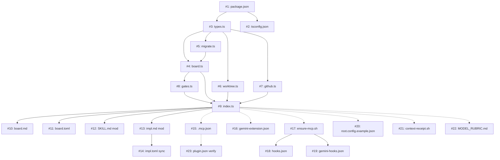

# Implementation Plan: Root Board Orchestration Layer

## Context & Motivation

**PRD**: [root-board-orchestration](../prds/root-board-orchestration.md)

Root handles single-feature workflows well but lacks multi-feature orchestration, GitHub issue lifecycle management, auto-progression through gates, and cross-harness coordination. This plan adds an orchestration layer via a new MCP server (`mcp-root-board`), a new command (`root:board`), and modifications to existing skills (`/root`, `/root:impl`) to enable autonomous issue-to-PR workflows.

## Scope

**In scope:**
- `mcp-root-board` MCP server (Node/TypeScript) with board state, gates, worktree lifecycle, and `gh` CLI integration
- `root:board` command (`.md` + `.toml` pair)
- `/root` skill modification to use board streams instead of `/tmp/root-session.json`
- `/root:impl` modification to read/update board state during execution
- `.mcp.json` and `gemini-extension.json` wiring for the new server
- `ensure-rag.sh` → `ensure-mcp.sh` rename to install both MCP servers
- `root.config.example.json` update with `board.gates` section
- Hook updates (`context-receipt.sh`) for board status in receipts
- Model/harness selection rubric document

**Out of scope:**
- Web UI or dashboard
- Background daemon / polling mode
- CI/CD gate integration
- Auto-merge of PRs
- GitHub MCP server integration

## Requirements Traceability

| Req ID | Description | Priority | Affected Files |
|--------|-------------|----------|----------------|
| REQ-001 | MCP server package | P0 | `mcp/mcp-root-board/src/*` (new package, external) |
| REQ-002 | Per-stream state files | P0 | `mcp/mcp-root-board/src/board.ts`, `mcp/mcp-root-board/src/migrate.ts` |
| REQ-003 | Stream lifecycle tools | P0 | `mcp/mcp-root-board/src/index.ts`, `mcp/mcp-root-board/src/board.ts` |
| REQ-004 | Worktree lifecycle | P0 | `mcp/mcp-root-board/src/worktree.ts` |
| REQ-005 | GitHub label integration | P0 | `mcp/mcp-root-board/src/github.ts` |
| REQ-006 | GitHub comment integration | P0 | `mcp/mcp-root-board/src/github.ts` |
| REQ-007 | Gate-based auto-progression | P0 | `mcp/mcp-root-board/src/gates.ts`, `mcp/mcp-root-board/src/index.ts` |
| REQ-008 | Gate configuration | P0 | `root.config.example.json` |
| REQ-009 | Execution-group-level assignment | P0 | `mcp/mcp-root-board/src/board.ts` |
| REQ-010 | `root:board` command | P0 | `commands/root/board.md`, `commands/root/board.toml` |
| REQ-011 | `/root` skill modification | P0 | `skills/root/SKILL.md` |
| REQ-012 | `/root:impl` modification | P0 | `commands/root/impl.md`, `commands/root/impl.toml` |
| REQ-013 | PR creation integration | P0 | `mcp/mcp-root-board/src/github.ts` |
| REQ-014 | Model/harness rubric | P1 | `skills/root/MODEL_RUBRIC.md` (new) |
| REQ-015 | `board_sync` label detection | P1 | `mcp/mcp-root-board/src/github.ts` |
| REQ-016 | `ensure-mcp.sh` hook update | P1 | `hooks/scripts/ensure-rag.sh` → `hooks/scripts/ensure-mcp.sh` |
| REQ-017 | Structured plan summary comments | P1 | `mcp/mcp-root-board/src/github.ts` |
| REQ-018 | `board_run` batch mode | P2 | `mcp/mcp-root-board/src/index.ts` |
| REQ-019 | `maxParallel` config | P2 | `mcp/mcp-root-board/src/gates.ts` |
| REQ-020 | Board status in receipt | P2 | `hooks/scripts/context-receipt.sh` |

## Change Manifest

| # | File | Action | Section / Function | Description | Reqs | Group | Status |
|---|------|--------|--------------------|-------------|------|-------|--------|
| 1 | `mcp/mcp-root-board/package.json` | create | — | Package manifest: name `mcp-root-board`, TypeScript build config, `@modelcontextprotocol/sdk` dependency, `gh` as peer dependency note. Entry point `dist/index.js`. | REQ-001 | A | [ ] |
| 2 | `mcp/mcp-root-board/tsconfig.json` | create | — | TypeScript config: strict mode, ES2022 target, outDir `dist/`, rootDir `src/`. | REQ-001 | A | [ ] |
| 3 | `mcp/mcp-root-board/src/types.ts` | create | `StreamState`, `GateConfig`, `GroupAssignment`, `BoardConfig` | Type definitions. `StreamState`: `{ schemaVersion, issue: { number, title, labels, state }, tier, status, branch, worktreePath, planPath, prdPath, groups: Record<string, GroupAssignment>, created, updated }`. `GroupAssignment`: `{ harness: "claude"\|"gemini"\|null, status: "pending"\|"in-progress"\|"complete", worktreePath: string\|null }`. `GateConfig` mirrors `root.config.json` → `board.gates`. `SCHEMA_VERSION = 1`. Status union type: `"queued"\|"planning"\|"plan-ready"\|"approved"\|"implementing"\|"validating"\|"pr-ready"\|"merged"\|"blocked"`. | REQ-002, REQ-008, REQ-009 | A | [ ] |
| 4 | `mcp/mcp-root-board/src/board.ts` | create | `readStream()`, `writeStream()`, `listStreams()`, `createStream()`, `updateStream()`, `deleteStream()` | Per-stream file I/O at `.root/board/<issue>.json`. `readStream(issue)` reads file, calls `migrate()` if `schemaVersion` is old, returns typed `StreamState`. `writeStream(issue, state)` does atomic write (temp + rename). `listStreams()` globs `*.json` in board dir, reads each. `createStream(issue, tier)` initializes a new stream file with status `"queued"`. `updateStream(issue, partial)` merges partial update into existing state, bumps `updated` timestamp. `deleteStream(issue)` removes the file. All functions take `boardDir` (resolved from `ROOT_DIR` env or cwd + `.root/board/`). Creates directory on first write if missing. | REQ-002, REQ-009 | A | [ ] |
| 5 | `mcp/mcp-root-board/src/migrate.ts` | create | `migrate(state)` | Lazy schema migration. Takes a `StreamState` (possibly old schema), returns current-schema `StreamState`. Switch on `schemaVersion`: if missing or 0, sets defaults and bumps to 1. Each future version adds a case. Pure function, no I/O — caller handles write-back. | REQ-002 | A | [ ] |
| 6 | `mcp/mcp-root-board/src/worktree.ts` | create | `createWorktree()`, `removeWorktree()`, `listWorktrees()`, `mergeWorktreeInto()` | Git worktree lifecycle via `child_process.execSync`. `createWorktree(projectDir, issue, branch)`: runs `git worktree add ../<project>-<issue> -b <branch>`, returns worktree path. `removeWorktree(worktreePath)`: runs `git worktree remove <path> --force`. `listWorktrees()`: parses `git worktree list --porcelain`. `mergeWorktreeInto(worktreePath, targetBranch)`: checks out target branch, runs `git merge <worktree-branch> --no-ff`, returns merge result (success/conflicts). All shell out to `git` via `execSync` with `cwd` set to project root. | REQ-004 | B | [ ] |
| 7 | `mcp/mcp-root-board/src/github.ts` | create | `setLabel()`, `removeLabel()`, `addComment()`, `getIssueLabels()`, `createPR()`, `getIssue()` | GitHub integration via `gh` CLI. `setLabel(issue, label)`: runs `gh issue edit <issue> --add-label <label>`. `removeLabel(issue, label)`: runs `gh issue edit <issue> --remove-label <label>`. `addComment(issue, body)`: runs `gh issue comment <issue> --body <body>`. `getIssueLabels(issue)`: runs `gh issue view <issue> --json labels`, parses JSON, returns label names array. `createPR(head, base, title, body)`: runs `gh pr create --head <head> --base <base> --title <title> --body <body>`, returns PR URL. `getIssue(issue)`: runs `gh issue view <issue> --json number,title,body,labels,state`, returns parsed object. All functions use `child_process.execSync`, throw on non-zero exit with the stderr message. `checkGhAuth()`: runs `gh auth status`, returns `{ authenticated: boolean, error?: string }`. | REQ-005, REQ-006, REQ-013, REQ-015 | B | [ ] |
| 8 | `mcp/mcp-root-board/src/gates.ts` | create | `evaluateGate()`, `loadGateConfig()`, `TRANSITIONS` | Gate evaluation logic. `TRANSITIONS` maps each status to its next status and gate name: `{ "queued": { next: "planning", gate: null }, "planning": { next: "plan-ready", gate: null }, "plan-ready": { next: "approved", gate: "plan_approval" }, ... }`. `loadGateConfig(rootDir)` reads `root.config.json` → `board.gates`, returns `GateConfig` with defaults for missing keys. `evaluateGate(gate, tier, config)` returns `{ action: "auto"\|"human", reason: string }`. For `plan_approval`, checks `config.plan_approval[tier]` (default: `"human"` for tier1, `"auto"` for tier2). For all other gates, checks `config[gate]` (default: `"auto"`). | REQ-007, REQ-008 | C | [ ] |
| 9 | `mcp/mcp-root-board/src/index.ts` | create | `main()`, tool registrations for `board_list`, `board_start`, `board_status`, `board_approve`, `board_run`, `board_sync`, `board_clean` | MCP server entry point using `@modelcontextprotocol/sdk`. Registers 7 tools. Each tool handler reads `ROOT_DIR` from env (default: cwd). **`board_list`**: calls `listStreams()`, returns formatted table (issue, title, status, worktree, groups). **`board_start`**: calls `getIssue()` to fetch issue context, `createStream()` with issue metadata, `createWorktree()` for the stream, `setLabel("root:planning")`, returns stream summary. **`board_status`**: calls `readStream()`, returns detailed status including per-group assignments. **`board_approve`**: calls `readStream()`, verifies status is `"plan-ready"`, calls `updateStream()` with status `"approved"`, calls `removeLabel("root:plan-ready")` + `setLabel("root:approved")`. **`board_run`**: the auto-progression loop — reads stream, evaluates gates via `evaluateGate()`, returns the next action needed (what the skill should execute) or advances status if no work needed. Does NOT execute implementation itself — returns instructions to the calling skill. **`board_sync`**: for each stream, calls `getIssueLabels()`, detects `root:approved` label → updates local status. Also detects closed issues → marks stream `"merged"`. **`board_clean`**: lists streams with status `"merged"` or `"pr-ready"`, calls `removeWorktree()` for each, calls `deleteStream()`. | REQ-001, REQ-003, REQ-007, REQ-015, REQ-018 | C | [ ] |
| 10 | `commands/root/board.md` | create | Full command definition | New `/root:board` command with subcommands: (default: list), `start <issue>`, `status [issue]`, `approve <issue>`, `run [issue]`, `sync`, `clean`. Each subcommand calls the corresponding `mcp-root-board` tool and formats output. `start` calls `board_start`, outputs stream summary. `run` calls `board_run` in a loop: reads the next action, dispatches to `/root` or `/root:impl` as appropriate, updates board state after each phase completes. `run` is the orchestration driver — it calls `board_run` (MCP) to determine *what* to do, then uses existing skills to *do* it. The `run` subcommand handles: Tier classification (delegates to `/root`), PRD creation (delegates to `/root:prd`), plan creation (spawns `team-architect`), implementation (delegates to `/root:impl`), PR creation (calls `board_pr` or `gh pr create` via the MCP). `--groups A,B` flag on `run` limits execution to specific groups for cross-harness splitting. | REQ-010 | D | [ ] |
| 11 | `commands/root/board.toml` | create | TOML metadata wrapper | Standard TOML envelope: `name = "board"`, `description = "..."`, `prompt = '''<content of board.md>'''`. | REQ-010 | D | [ ] |
| 12 | `skills/root/SKILL.md` | modify | Step 0, Step 6, Step 7, Step 8, Step 9 | **Step 0**: Currently checks `/tmp/root-session.json`. Change to: call `board_status` MCP tool for the current issue. If a stream exists and has `plan_path`, skip to Step 8. If no stream, proceed to Step 1. Remove all references to `/tmp/root-session.json`. **Step 6**: Currently writes `/tmp/root-session.json`. Change to: call `board_start` MCP tool (or `board_status` to update existing stream) with issue context, tier, docs read, recommendations. The board stream replaces the session file. **Step 7**: Add board status line to kickoff summary: `**Stream**: #<issue> (<status>)`. For Tier 1, update the "Next Step" section to reference `root:board run` as the autonomous option alongside manual `/root:prd` + `/root:impl`. **Step 8**: After plan is written by architect, call `board_run` to transition status to `"plan-ready"`. This triggers `setLabel("root:plan-ready")` and `addComment()` with plan summary via the MCP server. **Step 9**: Change handoff message to: "Run `/root:board run` for autonomous execution, or `/root:impl` for manual control." | REQ-011 | E | [ ] |
| 13 | `commands/root/impl.md` | modify | Shared Setup, Step 7, Step 10 | **Shared Setup**: Currently reads `/tmp/root-session.json`. Change to: call `board_status` MCP tool for the current issue. Fall back to session file if board has no stream (backward compat during transition). Extract `tier`, `plan_path`, `issue` from board stream. **Step 7 (Checkpoint)**: After reviewer PASS, call `board_status` update via MCP to record group completion. Update `groups[<letter>].status` to `"complete"`. When all groups complete, transition stream status to `"validating"`. **Step 10 (PR)**: After PR creation, call `board_run` to transition status to `"pr-ready"`. This triggers `setLabel("root:pr-ready")` and `addComment()` with PR link via the MCP server. | REQ-012, REQ-013 | E | [ ] |
| 14 | `commands/root/impl.toml` | modify | `prompt` field | Sync with `impl.md` changes. Copy the full updated content of `impl.md` into the `prompt = '''...'''` field. | REQ-012 | E | [ ] |
| 15 | `.mcp.json` | modify | `mcpServers` object | Add `"root-board"` entry alongside existing `"local-rag"`: `{ "command": "node", "args": ["${HOME}/.root-framework/mcp/node_modules/mcp-root-board/dist/index.js"], "env": { "ROOT_DIR": "." } }`. | REQ-001 | F | [ ] |
| 16 | `gemini-extension.json` | modify | `mcpServers` object | Add `"root-board"` entry with identical config to `.mcp.json` entry. | REQ-001 | F | [ ] |
| 17 | `hooks/scripts/ensure-rag.sh` | modify | Install logic, rename to `ensure-mcp.sh` | Rename file to `ensure-mcp.sh`. Add `mcp-root-board` install check alongside existing `mcp-local-rag` check: `BOARD_BIN="$INSTALL_DIR/node_modules/mcp-root-board/dist/index.js"`, if not present, `npm install mcp-root-board`. Add `gh auth status` check at end — if not authenticated, output warning: `"⚠️  gh CLI not authenticated. Board GitHub features (labels, comments, PRs) will be unavailable. Run: gh auth login"`. Do not fail the hook on missing auth — board still works locally without GitHub integration. | REQ-016 | F | [ ] |
| 18 | `.claude-plugin/hooks.json` | modify | `SessionStart` hooks array | Update script path from `ensure-rag.sh` to `ensure-mcp.sh`. | REQ-016 | F | [ ] |
| 19 | `hooks/gemini-hooks.json` | modify | `SessionStart` hooks array | Update script path from `ensure-rag.sh` to `ensure-mcp.sh`. | REQ-016 | F | [ ] |
| 20 | `root.config.example.json` | modify | Top-level object | Add `"board"` section: `{ "gates": { "plan_approval": { "tier1": "human", "tier2": "auto" }, "reviewer_pass": "auto", "validation": "auto", "pr_creation": "auto" }, "maxParallel": 3 }`. | REQ-008, REQ-019 | F | [ ] |
| 21 | `hooks/scripts/context-receipt.sh` | modify | Receipt output section | After existing session receipt, check for board state: glob `.root/board/*.json`. If any exist, add a "Board" section to the receipt box listing each stream: issue number, title, status. Replace `/tmp/root-session.json` reads with board reads where applicable. | REQ-020 | F | [ ] |
| 22 | `skills/root/MODEL_RUBRIC.md` | create | Full rubric document | Model/harness selection rubric. Defines when to use Opus vs Sonnet vs Haiku, Claude Code vs Gemini CLI, per workflow phase. Sections: Planning (Opus — deep reasoning, plan-mode), Implementation (Sonnet — cost-efficient, bounded tasks), Complex Implementation (Opus — novel architecture, ambiguous requirements), Review (Sonnet — structured checklist), Testing (Sonnet — parallel with implementation), Exploration (either harness — model matters less). Cross-harness guidance: split features across harnesses at the execution group level, not the feature level. One harness per group, tracked by the board. | REQ-014 | G | [ ] |
| 23 | `.claude-plugin/plugin.json` | modify | `commands` and `skills` arrays | No change needed — `commands` points at `./commands/root` directory (already picks up new `board.md`/`board.toml`). Verify `skills` array doesn't need updating if `MODEL_RUBRIC.md` is referenced from within `SKILL.md` rather than as a standalone skill. | REQ-010, REQ-014 | F | [ ] |

## Dependency Graph

_Solid arrows = hard dependency (must complete first). Dashed = soft dependency (can start independently, needs integration later)._

## Execution Groups

### Group A: MCP Server Core (Types + State + Migration)
**Agent**: `team-implementer` (sonnet)
**Changes**: #1, #2, #3, #4, #5
**Sequence**: package.json (#1) + tsconfig.json (#2) → types.ts (#3) → migrate.ts (#5) → board.ts (#4)
**Tests**: Create `mcp/mcp-root-board/src/__tests__/board.test.ts` — test `createStream()` creates correct file structure, `readStream()` returns typed state, `writeStream()` does atomic write (no partial writes on crash), `listStreams()` finds all `.json` files, `updateStream()` merges partial updates, `deleteStream()` removes file. Test `migrate()` handles missing schemaVersion, upgrades from v0 to v1.

### Group B: Git + GitHub Integration
**Agent**: `team-implementer` (sonnet)
**Changes**: #6, #7
**Sequence**: worktree.ts (#6), github.ts (#7) — independent of each other, both depend on types from Group A
**Depends on**: Group A completing #3 (types.ts)
**Tests**: Create `mcp/mcp-root-board/src/__tests__/worktree.test.ts` — test `createWorktree()` generates correct path and branch name, `removeWorktree()` calls git with correct args, `listWorktrees()` parses porcelain output. Create `mcp/mcp-root-board/src/__tests__/github.test.ts` — test `setLabel()`/`removeLabel()` build correct `gh` commands, `getIssueLabels()` parses JSON response, `createPR()` returns URL from stdout, `checkGhAuth()` returns correct status. Use `jest.mock('child_process')` to mock `execSync` — do not call real `gh` or `git` in tests.

### Group C: Gates + MCP Server Entry Point
**Agent**: `team-implementer` (sonnet)
**Changes**: #8, #9
**Sequence**: gates.ts (#8) → index.ts (#9)
**Depends on**: Group A (#3, #4), Group B (#6, #7)
**Tests**: Create `mcp/mcp-root-board/src/__tests__/gates.test.ts` — test `evaluateGate("plan_approval", "tier1", defaultConfig)` returns `"human"`, `evaluateGate("plan_approval", "tier2", defaultConfig)` returns `"auto"`, custom config overrides defaults. Create `mcp/mcp-root-board/src/__tests__/index.test.ts` — test each tool registration exists, test `board_start` creates stream + worktree + sets label, test `board_approve` rejects non-plan-ready streams, test `board_sync` detects external label changes.

### Group D: Board Command
**Agent**: `team-implementer` (sonnet)
**Changes**: #10, #11
**Sequence**: board.md (#10) → board.toml (#11)
**Depends on**: Group C (#9) — command calls MCP tools defined in index.ts
**Tests**: No unit tests for command files (they are prompt templates). Verify by reading both files and confirming: all 7 subcommands documented, MCP tool names match those registered in index.ts, TOML `prompt` field matches MD content.

### Group E: Skill Modifications
**Agent**: `team-implementer` (sonnet)
**Changes**: #12, #13, #14
**Sequence**: SKILL.md (#12) and impl.md (#13) can be done in parallel → impl.toml (#14) after impl.md
**Depends on**: Group C (#9) — skills call MCP tools defined in index.ts
**Tests**: No unit tests for skill files (prompt templates). Verify by reading and confirming: all `/tmp/root-session.json` references replaced with board MCP calls, backward-compat fallback exists in impl.md Shared Setup, board status transitions are called at correct points.

### Group F: Wiring + Config + Hooks
**Agent**: `team-implementer` (sonnet)
**Changes**: #15, #16, #17, #18, #19, #20, #21, #23
**Sequence**: .mcp.json (#15) + gemini-extension.json (#16) + root.config.example.json (#20) (parallel) → ensure-mcp.sh (#17) → hooks.json (#18) + gemini-hooks.json (#19) (parallel) → context-receipt.sh (#21) → plugin.json verify (#23)
**Depends on**: Group C (#9) — needs MCP server to exist for correct binary path. Soft dependency — can start with config files while server is being built.
**Tests**: No unit tests for config/hook files. Verify by reading: `.mcp.json` has correct `root-board` entry with `ROOT_DIR` env, `gemini-extension.json` matches, `ensure-mcp.sh` checks both binaries and `gh auth status`, hook JSON files reference `ensure-mcp.sh`, `root.config.example.json` has `board` section, `context-receipt.sh` reads `.root/board/` directory.

### Group G: Model Rubric Documentation
**Agent**: `team-implementer` (sonnet)
**Changes**: #22
**Sequence**: Single file
**Depends on**: None — documentation only, can be written in parallel with everything
**Tests**: No unit tests. Verify document covers all workflow phases (planning, implementation, review, testing, exploration) with specific model and harness recommendations.

## Coding Standards Compliance

- [ ] All new TypeScript exports have JSDoc with @param, @returns, @throws
- [ ] No `any` types — use generics or narrowed unions
- [ ] No `console.log` in production code — use MCP SDK logging
- [ ] Atomic file writes (temp + rename) for all state mutations
- [ ] All `gh` CLI calls wrapped in try/catch with meaningful error messages
- [ ] All shell commands use `execSync` with explicit `cwd` and `encoding: 'utf-8'`

## Risk Register

| Risk | Probability | Impact | Mitigation |
|------|-------------|--------|------------|
| `@modelcontextprotocol/sdk` API changes | Low | High | Pin exact version in package.json. SDK is stable post-1.0. |
| Worktree cleanup fails (locked files, running processes) | Medium | Low | `removeWorktree` uses `--force` flag. `board_clean` reports failures, doesn't crash. |
| `gh` CLI not installed | Low | High | `ensure-mcp.sh` checks for `gh` binary, not just auth. Falls back to local-only mode. |
| impl.toml / impl.md divergence | Medium | Medium | Group E explicitly includes toml sync step. Add note in CLAUDE.md about keeping them in sync. |
| MCP server npm package not yet published | High | High | During development, use `npm link` or relative path in `.mcp.json`. Publish to npm before v2.0 release. |

## Verification Plan

- [ ] Lint + type-check passes: `cd mcp/mcp-root-board && npm run build` (TypeScript compilation is the type-check)
- [ ] Unit tests pass: `cd mcp/mcp-root-board && npm test`
- [ ] **Manual — Tier 2 autonomous flow**: Create a test issue on a repo, run `root:board start #N`, then `root:board run #N`. Verify: stream file created at `.root/board/N.json`, worktree created, issue labeled `root:planning`, implementation proceeds, PR created, issue labeled `root:pr-ready`. Zero human touchpoints after initial command.
- [ ] **Manual — Tier 1 plan-and-pause**: Create a feature issue, run `root:board start #N` + `root:board run #N`. Verify: plan is created, issue comment posted with plan summary, issue labeled `root:plan-ready`, stream pauses. Then `root:board approve #N` + `root:board run #N` — verify implementation proceeds to PR.
- [ ] **Manual — Cross-harness**: Start a Tier 1 feature with 2+ execution groups. Assign different groups to different harness sessions. Verify both complete independently, board tracks per-group status, final merge produces single PR.
- [ ] **Manual — board_sync label detection**: Add `root:approved` label directly in GitHub UI. Run `root:board sync`. Verify local stream state updates to `"approved"`.
- [ ] **Negative — duplicate group assignment**: Attempt to `board_run --groups A` when group A is already assigned. Verify MCP server rejects with clear error.
- [ ] **Negative — missing gh auth**: Unset `gh` auth, run `board_start`. Verify warning is shown but stream is still created locally.
