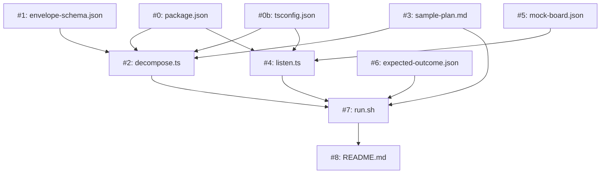

# Implementation Plan: Scion Envelope Prototype (Root 3.0 Research Spike)

## Context & Motivation

**Issue**: N/A — internal research spike ahead of Root 3.0 design lock-in.

Root 3.0 will marry to Scion as its execution substrate. The central unknown on the planning → execution seam is **how a monolithic `plan.md` becomes input to N parallel containerized agents**. Three interface decisions need validation before we commit code in 2.2+:

1. Envelope format — how do we package "one group's slice of a plan" for agent consumption?
2. Callback mechanism — how does an agent report "row #3 complete, sha abc123" back to Root?
3. State ownership — where does reconciliation state live now that plan.md is no longer mutable during execution?

This spike exercises all three with a throwaway 2-agent run. Findings feed directly into 2.2's `board_claim` data-model work and 2.3's executor abstraction.

**Explicitly a throwaway.** Nothing in this plan targets code that must survive into 2.2. Lessons carry forward; artifacts do not.

## Scope

**In scope:**
- Envelope JSON schema
- Sample plan.md with 2 trivial groups (no real code impact — each group writes a timestamp to a file)
- Decomposition script (plan.md + group-id → envelope JSON)
- Two-agent dispatch via `scion start` (one Claude, one Gemini)
- Callback via `scion message root-listener "..."` with structured completion payload
- Listener script that scrapes messages and updates a mock board stream JSON
- End-to-end orchestration script that runs the full loop and validates outcome

**Out of scope:**
- Any changes to Root's actual code (`skills/`, `commands/`, `agents/`, `mcp/`)
- Real implementation inside either group (groups do trivial timestamp writes)
- Retry/blocked-state handling beyond "listener reports missing completion"
- HTTP Root service design (spike uses `scion message` only; HTTP is 3.0 work)
- Grove-mounted vs Root-service-owned plan distribution (spike uses local filesystem)
- Standalone mode parity

## Requirements Traceability

| Req ID | Description | Priority | Affected Files |
|--------|-------------|----------|----------------|
| REQ-001 | Envelope schema defined as JSON Schema covering: group-id, plan reference, change manifest entries, test task, coding standards, validation commands, callback target | P0 | `prototypes/scion-envelope/envelope-schema.json` |
| REQ-002 | Sample plan.md with exactly 2 groups (A, B), 1 Change Manifest row each, no hard dependencies between groups | P0 | `prototypes/scion-envelope/sample-plan.md` |
| REQ-003 | Decomposition function takes `(plan-path, group-id)` and emits a valid envelope conforming to REQ-001 | P0 | `prototypes/scion-envelope/src/decompose.ts` |
| REQ-004 | Orchestration script dispatches Group A to Claude container, Group B to Gemini container, each with only its envelope | P0 | `prototypes/scion-envelope/run.sh` |
| REQ-005 | Each agent reports completion via `scion message root-listener '{"group":"A","row":1,"sha":"<sha>","status":"complete"}'` | P0 | `prototypes/scion-envelope/sample-plan.md` (agent prompt section), `run.sh` |
| REQ-006 | Listener scrapes Scion messages, updates `mock-board.json` reconciliation state in real time | P0 | `prototypes/scion-envelope/src/listen.ts` |
| REQ-007 | Final validation: `mock-board.json` matches `expected-outcome.json`, script exits 0 | P0 | `prototypes/scion-envelope/run.sh` |
| REQ-008 | README documenting: how to run, what each file does, what to look for when attaching to agents | P1 | `prototypes/scion-envelope/README.md` |

_Every file in the Change Manifest maps to at least one requirement._

## Change Manifest

| # | File | Action | Section / Function | Description | Reqs | Group | Status |
|---|------|--------|--------------------|-------------|------|-------|--------|
| 0 | `prototypes/scion-envelope/package.json` | create | Root manifest | `name: scion-envelope-prototype`, `private: true`, `type: "module"`. devDependencies: `typescript@^5`, `tsx@^4`, `vitest@^2`, `gray-matter@^4`, `remark@^15`, `remark-parse@^11`, `unified@^11`, `ajv@^8`, `execa@^9`, `@types/node@^20`. Scripts: `decompose` (`tsx src/decompose.ts`), `listen` (`tsx src/listen.ts`), `test` (`vitest run`), `typecheck` (`tsc --noEmit`), `lint` (`eslint .` — optional, skip if it expands scope). | REQ-001, REQ-003, REQ-006 | A | [ ] |
| 0b | `prototypes/scion-envelope/tsconfig.json` | create | TS compiler config | `target: ES2022`, `module: NodeNext`, `moduleResolution: NodeNext`, `strict: true`, `noUncheckedIndexedAccess: true`, `resolveJsonModule: true`, `esModuleInterop: true`, `skipLibCheck: true`. Include `src/**/*` and `tests/**/*`. | REQ-003, REQ-006 | A | [ ] |
| 1 | `prototypes/scion-envelope/envelope-schema.json` | create | Top-level schema | Draft-07 JSON Schema. Required fields: `groupId` (string, e.g. "A"), `planSlug` (string), `agentTemplate` (enum: claude, gemini), `changes` (array of {rowNumber, filePath, action, section, description, linkedReqs}), `testTask` (string), `codingStandards` (array of strings), `validation` (object with lintCommand, testCommand), `callback` (object with target="root-listener", format="json"). | REQ-001 | A | [ ] |
| 2 | `prototypes/scion-envelope/src/decompose.ts` | create | `decompose(planPath: string, groupId: string): Envelope` + CLI | Parse plan.md with `gray-matter` (frontmatter) + `remark` / `remark-parse` (markdown AST). Locate "Change Manifest" table, filter rows where Group column == groupId. Locate Execution Group section with matching letter, extract Tests line. Read shared context from plan frontmatter and Coding Standards section. Emit object conforming to envelope-schema.json. Validate against schema before return using `ajv`. CLI entry point via a thin wrapper: `npm run decompose -- <plan> <group-id>` prints envelope JSON to stdout. Export `Envelope` type derived from the JSON schema (via `json-schema-to-typescript` at build time, OR hand-written and kept in sync with a unit test that asserts shape against the schema). | REQ-003, REQ-001 | A | [ ] |
| 3 | `prototypes/scion-envelope/sample-plan.md` | create | Whole file | Minimal valid plan following `templates/plans/TEMPLATE.md` format. Two Execution Groups (A, B). Group A Change Manifest row: "create `prototypes/scion-envelope/out/group-a.txt` with current UTC timestamp". Group B row: same but `group-b.txt`. No dependencies between groups. Coding Standards: single item "File must end with trailing newline". Verification: "both files exist and contain a parseable ISO-8601 timestamp". | REQ-002, REQ-005 | A | [ ] |
| 4 | `prototypes/scion-envelope/src/listen.ts` | create | `main()` + `handleMessage(rawMsg: string, statePath: string): Promise<void>` | Subscribes to `scion message` stream (command: `scion logs --follow root-listener` spawned via `execa` / `node:child_process`, OR polling `scion list --json` — pick whichever Scion exposes cleanly in its current CLI). Parses each message body as JSON. On valid `{group, row, sha, status}` payload, reads `mock-board.json`, updates `manifestStatus[row]` to `{status, sha}`, writes back atomically via `fs.writeFile(temp)` + `fs.rename(temp, final)`. On invalid or missing fields, logs via `console.warn` and ignores. Exits with code 0 when all rows in `sample-plan.md`'s Change Manifest reach `status: "complete"`; exits with code 2 on timeout (5-minute wall clock from start). | REQ-006 | B | [ ] |
| 5 | `prototypes/scion-envelope/mock-board.json` | create | Initial state document | JSON object: `{streamId: "prototype", planPath: "prototypes/scion-envelope/sample-plan.md", status: "implementing", manifestStatus: {"1": {status: "pending", sha: null}, "2": {status: "pending", sha: null}}}`. Gets mutated by listen.py during the run. | REQ-006 | B | [ ] |
| 6 | `prototypes/scion-envelope/expected-outcome.json` | create | Terminal state document | Same shape as mock-board.json but with both rows `status: "complete"` and non-null shas. Used by run.sh for jq-based diff at end of run. | REQ-007 | B | [ ] |
| 7 | `prototypes/scion-envelope/run.sh` | create | Top-level orchestration | Steps: (1) reset mock-board.json from expected initial state, (2) start listener: `npx tsx src/listen.ts &`, save PID, (3) decompose group A: `npx tsx src/decompose.ts sample-plan.md A > /tmp/env-a.json`, same for B, (4) `scion start claude-prototype --template claude "$(cat /tmp/env-a.json)"`, same for gemini with env-b.json, (5) wait for listener to exit (it exits when all rows complete; 5-min timeout), (6) compare mock-board.json to expected-outcome.json via `jq -S . <both> \| diff`, (7) kill listener, `scion stop` both agents, exit with diff status. Bash with `set -euo pipefail`. | REQ-004, REQ-007 | C | [ ] |
| 8 | `prototypes/scion-envelope/README.md` | create | Whole file | Sections: Purpose (links back to this plan), Prerequisites (Scion installed + authenticated, `jq`, Node 20+, `npm install` in the spike directory to pull `gray-matter` / `remark` / `ajv` / `execa` / `tsx` / `vitest`), How to run (`bash run.sh`), What to look for (what each of the 8 files demonstrates, what the agents see when you `scion attach`), What we expect to learn (research questions from open-questions section below). Explicitly note this is throwaway. | REQ-008 | C | [ ] |

_Action: `create` (all new — spike directory doesn't exist yet). Status updated by implementer: `[ ]` pending, `[~]` in progress, `[x] (<sha>)` complete._

## Dependency Graph

_Solid arrows = hard dependency. Group A produces the decomposer and its inputs; Group B produces the listener and its state files; Group C integrates via run.sh and documents._

## Execution Groups

### Group A: Envelope + Decomposition
**Agent**: `team-implementer`
**Changes**: #0, #0b, #1, #2, #3
**Sequence**: package.json + tsconfig.json (#0, #0b) → schema (#1) and sample plan (#3) in parallel → decomposer (#2, reads both)
**Tests**: Create `prototypes/scion-envelope/tests/decompose.test.ts` (vitest) — test cases: (a) valid plan + existing group returns envelope that validates against envelope-schema.json, (b) valid plan + nonexistent group throws an error mentioning the group ID, (c) plan with missing Coding Standards section emits empty `codingStandards` array (not error), (d) `Envelope` TS type shape matches the JSON schema (a test that loads the schema and asserts structural parity — catches drift between hand-written type and schema).

### Group B: Listener + State
**Agent**: `team-implementer`
**Changes**: #4, #5, #6
**Sequence**: State files (#5, #6) → listener (#4, reads/writes state)
**Tests**: Create `prototypes/scion-envelope/tests/listen.test.ts` (vitest) — test cases: (a) valid completion message updates the targeted row, leaves others untouched, (b) malformed JSON message logged and ignored (use `vi.spyOn(console, 'warn')`), (c) completion for unknown row number logged and ignored (no throw), (d) listener exits with code 0 when all rows reach `complete`, (e) atomic write: simulate process kill between temp-write and rename; state file is either fully old or fully new, never a partial JSON document. Use `fs.promises` with a temp directory per test (`os.tmpdir()` + `mkdtemp`).

### Group C: Orchestration + Docs
**Agent**: `team-implementer`
**Changes**: #7, #8
**Depends on**: Groups A and B completing (C integrates both)
**Tests**: End-to-end in `prototypes/scion-envelope/tests/e2e.test.sh` — run `bash run.sh` in a temp directory, either with Scion in a known state OR with `scion` stubbed to a local shim that echoes envelopes back as messages (offline mode for CI). Assert exit code 0 and empty output from the run.sh diff step.

_Groups A and B execute in parallel. Group C runs sequentially after both complete. `/root:impl` drives execution._

## Coding Standards Compliance

- [ ] TypeScript strict mode (tsconfig `strict: true`, `noUncheckedIndexedAccess: true`); no `any` without a `// eslint-disable-next-line` + justification comment; `Envelope` and `BoardState` types exported from a shared `src/types.ts` rather than inlined per file
- [ ] ES modules only (`"type": "module"` in package.json); `.js` extensions on import paths (per NodeNext resolution); no CommonJS
- [ ] Run via `tsx` directly — no build step; CI runs `tsc --noEmit` for typecheck
- [ ] Bash files start with `#!/usr/bin/env bash` and `set -euo pipefail`
- [ ] JSON files end with trailing newline; 2-space indent; keys alphabetized where order is not semantic
- [ ] No absolute paths — everything is relative to the spike directory or the repo root
- [ ] No secrets, no tokens, no hardcoded credentials (Scion manages those per its own auth)

## Risk Register

| Risk | Probability | Impact | Mitigation |
|------|-------------|--------|------------|
| Scion CLI surface changes during spike development | Low | Medium | Track Scion `main` (latest). Scion team commits to additive-only API evolution for existing primitives, so new fields / new commands are tolerated, breaking renames are not expected. If a breaking change does land mid-spike, log it in README "What we learned" as a signal for 2.2+ design, then update the spike. |
| `scion message` / `scion logs --follow` streaming semantics don't match what listen.py expects | Medium | High | Pick the callback mechanism in REQ-005/REQ-006 only after reading Scion's actual message-passing docs. Fallback: listener polls `scion list --json` instead of streaming. |
| Envelope schema v1 turns out to be the wrong shape (rigid/loose/missing fields) | High | Low | This spike EXISTS to discover that. Iterate within the spike, not later. Log lessons in README "What we learned" section. |
| Time sink — spike expands into production implementation | Medium | High | Hard cap: 2-3 sessions of spike work. If unfinished, capture findings in open questions below and abandon artifacts. Do not carry code into 2.2. |
| Scion container credential setup blocks the run | Medium | Medium | Before any code: validate `scion start claude "echo hello"` works end-to-end. If not, stop and resolve auth before proceeding. |

## Verification Plan

- [ ] `npx tsc --noEmit` from `prototypes/scion-envelope/` passes with zero errors
- [ ] `npm test` (vitest) from `prototypes/scion-envelope/` passes (unit tests from Group A and B)
- [ ] `bash prototypes/scion-envelope/tests/e2e.test.sh` exits 0
- [ ] **Manual**: Run `bash prototypes/scion-envelope/run.sh` with real Scion agents. `scion attach claude-prototype` and confirm: the agent received ONLY envelope A (not the full plan), the agent produced the expected file, the agent sent one completion message. Repeat for gemini-prototype with envelope B.
- [ ] **Manual**: Inspect `mock-board.json` after the run — both rows `status: complete` with non-null SHAs from the agent's commits.
- [ ] **Negative**: Kill one agent mid-run (`scion stop gemini-prototype` after ~5s). Listener should time out after 5 minutes and report `{"status": "blocked", "reason": "missing completion for row 2"}` to stderr. `mock-board.json` should show row 1 complete, row 2 still pending.

## Target Metrics

_Directional indicators tracked for reporting. Missing a target does not block shipping this spike — it gets noted in README "What we learned" and feeds into 2.2+ design._

| Metric | Goal | Rationale | Actual (filled at PR time) |
|--------|------|-----------|----------------------------|
| Envelope size (per group) | ≤ 5 KB | Context budget. Over this and we need a shared-preamble strategy for 10+ group plans. | — |
| End-to-end run time (run.sh) | ≤ 2 min | Iteration loop speed. If substantially slower, surfacing that shapes the 3.0 UX ("runs in N seconds" becomes a user-facing claim). | — |
| Inter-agent messages | 2 (one completion per agent) | Proxy for noise. If agents need N messages to coordinate trivial work, the callback protocol is too chatty. | — |
| Lines of TypeScript in `src/decompose.ts` | ≤ 200 | If decomposition needs more than that, the plan format is too ambiguous and the 2.2+ implementation should fix the plan format before inheriting the complexity. (Slightly higher than the Python target because TS tends to be more verbose for equivalent logic — imports, types, narrowing.) | — |

## Open Questions

These are the research questions this spike is designed to answer. Do NOT treat them as blocked-on; the spike exists specifically to resolve them. Log answers in README "What we learned" at end of spike.

1. **Envelope format: JSON, YAML, or Markdown?** JSON is the starting bet (easier to generate and validate). If agents struggle to consume JSON-embedded-in-prompt cleanly, try markdown with YAML frontmatter.
2. **Callback mechanism: `scion message` vs HTTP endpoint vs both?** Spike uses `scion message` only. If it's too chatty or too opaque for multi-message flows (progress + completion + errors), that's data for 3.0's HTTP design.
3. **Plan file authoring: architect writes envelopes alongside plan, or Root decomposes at dispatch?** Spike assumes the latter (decompose.py runs at dispatch). If the decomposition itself needs architectural context the decomposer doesn't have, that answers the question.
4. **Shared preamble extraction?** Defer until after spike completes with small plans. Open question: at what plan size does duplicated shared context in N envelopes become unacceptable?
5. **What's the right primitive for "agent reports completion"?** Is it always `{group, row, sha, status}` or do we need richer payloads (tests passed, validation output, metric actuals)? Let the spike surface what's insufficient.

---

_End of plan. After spike completes, write findings into `docs/plans/scion-envelope-prototype-findings.md` — a short debrief that feeds into the 2.2 `board_claim` design._
