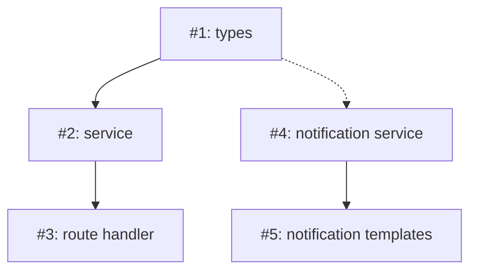

# Plan Decomposition via Dependency Graph Analysis — Product Requirements Document

**Status:** Draft
**Author:** Jamie Duncan
**Date:** 2026-04-12

---

## 1. Problem Statement

A single GitHub issue often contains multiple independent concerns masquerading as one feature. "Add Stripe payments, refactor notifications, and migrate auth" is three features in a trenchcoat. When Root plans this as one monolithic stream, the implementing agent must hold context for unrelated domains simultaneously — degrading code quality, producing incoherent PRs, and wasting context window on cross-domain attention.

Research confirms the impact: multi-agent approaches show +81% improvement on parallelizable tasks but up to 70% *degradation* on sequential/coupled ones (Augment Code). Decomposition quality is the dominant factor in agent performance — 10-40pp improvement when decomposition follows actual constraint structure rather than arbitrary heuristics (ACONIC). The critical signal is concern independence, not task count.

Root's architect already produces the data needed to detect this: the Dependency Graph. Independent subgraphs in the graph represent independent concerns. Connected subgraphs represent coupled work that benefits from shared context. The decomposition decision is already encoded in the plan — Root just doesn't act on it.

## 2. Proposed Solution

After the architect produces an Implementation Plan, analyze the Dependency Graph for disconnected subgraphs. Each disconnected subgraph represents an independent concern that should become its own sub-issue, board stream, and PR. Connected subgraphs stay together as a single stream — even if large — because they share context that an agent needs to hold.

This is not arbitrary splitting. A 25-file payment integration with a fully connected dependency graph stays as one PR. Three unrelated 5-file changes with no dependencies between them become three focused PRs. The plan's own structure determines decomposition.

For `--auto` streams, decomposition happens automatically. For manual streams, the user is presented with the subgraph analysis and chooses.

## 3. Goals & Non-Goals

### Goals
- Detect independent concerns within a single plan using Dependency Graph analysis
- Produce coherent, feature-scoped PRs — each PR represents a legitimate concern, not an arbitrary slice
- Enable auto-decomposition for `--auto` streams with zero human intervention
- Each sub-issue inherits board orchestration: own stream, worktree, labels, auto-progression
- Parent stream tracks child completion
- Minimize agent context waste — each sub-agent only loads context relevant to its concern

### Non-Goals
- Not using arbitrary thresholds (file count, group count) as decomposition signals
- Not decomposing connected subgraphs — coupled work stays together regardless of size
- Not auto-decomposing during PRD phase — decomposition happens after the architect produces the plan, because the plan is what reveals the structure
- Not handling cross-sub-issue dependencies — if groups are dependent, they stay in the same sub-issue
- Not producing rollup PRs — each sub-issue gets its own PR; the parent issue closes when all children merge

## 4. Functional Requirements

### Must Have (P0)

- [ ] REQ-001: Dependency Graph subgraph analysis — Given a Mermaid DAG from the Implementation Plan, identify disconnected subgraphs. A disconnected subgraph is a set of Execution Groups with no hard dependency edges (`-->`) connecting them to any group outside the set. Soft dependencies (`.->`) do not prevent decomposition. Return the list of subgraphs, each containing its group letters and Change Manifest entries.

- [ ] REQ-002: Decomposition decision logic — If the Dependency Graph contains exactly one connected component (all groups are reachable from all others via hard edges), do not decompose. If it contains 2+ disconnected components, decomposition is indicated. This is the sole decomposition signal — no file count or group count thresholds.

- [ ] REQ-003: Auto-decomposition for `--auto` streams — When `board_run` advances an `--auto` stream past plan approval and the plan has multiple disconnected subgraphs, automatically decompose: create sub-issues, start sub-streams, and mark the parent as `decomposed`. No human intervention.

- [ ] REQ-004: Manual decomposition prompt — For non-`--auto` streams, when `/root:impl` reaches Step 3 and the plan has multiple disconnected subgraphs, present the analysis to the user: show each subgraph with its groups, files, and scope. Ask: "This plan contains N independent concerns. Decompose into separate issues? (Recommended)" Options: decompose all, implement as one, choose which to decompose.

- [ ] REQ-005: Sub-issue creation — For each subgraph being decomposed, create a GitHub issue via `gh issue create` with: the subgraph's Execution Groups and Change Manifest entries, linked requirements (REQ IDs), reference to the parent issue (`Part of #<parent>`), reference to the full Implementation Plan. The issue title follows: `<parent-title>: <primary-group-name>`.

- [ ] REQ-006: Sub-stream creation — After creating each sub-issue, call `board_start` with `parentIssue` set to the parent issue number. Each sub-stream inherits `autoApprove` from the parent. Each sub-stream gets its own worktree and labels.

- [ ] REQ-007: Parent stream state — Add `childIssues: number[]` and `parentIssue: number | null` to `StreamState`. When a stream is decomposed, set its status to `decomposed` and populate `childIssues`. The parent does not implement — children carry the work.

- [ ] REQ-008: New stream status `decomposed` — A parent stream that has been split into sub-issues. It is not `implementing`. `board_run` on a decomposed stream checks child status instead of advancing its own state machine.

- [ ] REQ-009: Parent completion tracking — `board_sync` and `board_run` on a decomposed parent check all `childIssues`. When all children are `pr-ready` or `merged`, the parent transitions to `pr-ready` (or `merged` if all children are merged). This is the only way a decomposed parent advances.

- [ ] REQ-010: `board_list` hierarchy display — When listing streams, indent child streams under their parent:
  ```
  #42   payments + notifications     decomposed   —
    #201  payments: Backend           implementing  ../proj-201
    #202  payments: Frontend          pr-ready      ../proj-202
    #203  notifications: Refactor     implementing  ../proj-203
  ```

- [ ] REQ-011: Sub-issue plan slicing — Each sub-issue receives a scoped slice of the parent plan: only its Execution Groups, its Change Manifest entries, its subset of the Dependency Graph, and its subset of the Requirements Traceability table. The sub-plan is written to `<plansDir>/<parent-slug>-<group-slug>.md` and ingested into RAG.

### Should Have (P1)

- [ ] REQ-012: `board_delete` cascading — When deleting a parent stream, also delete all child streams and their worktrees. When deleting a child stream, remove it from the parent's `childIssues` array.

- [ ] REQ-013: Decomposition summary on GitHub — Post a comment on the parent issue listing the sub-issues created, their scope, and links. This gives visibility to anyone watching the issue.

- [ ] REQ-014: Sub-issue tier classification — Sub-issues created from decomposition should be classified as Tier 2 by default (they are bounded, focused, single-concern work), unless the subgraph has 3+ Execution Groups, in which case it stays Tier 1 with its own planning cycle.

### Nice to Have (P2)

- [ ] REQ-015: Decomposition dry-run — `root:board decompose #42 --dry-run` shows the subgraph analysis and proposed sub-issues without creating anything. Useful for reviewing what would happen before committing.

- [ ] REQ-016: Re-composition — If all sub-issues are still in `queued` or `planning` (no work started), allow re-composing them back into the parent stream. Deletes sub-issues, returns parent to `approved` status.

## 5. Technical Considerations

### Dependency Graph Parsing

The architect produces Mermaid DAGs:



To find disconnected subgraphs, build an adjacency list from hard edges only (`-->`), then run connected components (BFS/DFS). In the example above:
- Subgraph 1: {A1, A2, A3} (connected via hard edges)
- Subgraph 2: {B4, B5} (connected via hard edge, only soft-linked to subgraph 1)

This is a standard graph algorithm — no external dependencies needed.

### Where the Analysis Runs

The subgraph analysis is logic, not an MCP tool. It belongs in the `/root:impl` command (Step 3) and the `root:board run` orchestration loop. The Implementation Plan is a markdown file — parsing the Mermaid block and running connected components is straightforward string parsing + graph traversal.

Alternatively, the analysis could be a new MCP tool (`board_analyze_plan`) that takes a plan path and returns the subgraph structure. This would keep the logic in the MCP server and make it callable from both harnesses consistently.

### Plan Slicing

When creating sub-plans, extract from the parent plan:
- **Change Manifest**: rows where Group column matches this subgraph's groups
- **Execution Groups**: sections for this subgraph's groups only
- **Dependency Graph**: Mermaid subgraph with only this subgraph's nodes and edges
- **Requirements Traceability**: rows where Affected Files appear in this subgraph's Change Manifest
- **Verification Plan**: items relevant to this subgraph's changes
- **Coding Standards**: copied in full (applies to all sub-plans)

The sub-plan uses the same TEMPLATE.md format. It's a complete, self-contained Implementation Plan — an agent can execute it without referencing the parent.

### StreamState Changes

```typescript
// Additions to StreamState
parentIssue: number | null;    // if this stream was decomposed from a parent
childIssues: number[];         // sub-issues this stream was decomposed into
```

New status value: `"decomposed"` added to `StreamStatus` union.

Migration: existing streams get `parentIssue: null`, `childIssues: []`.

### Interaction with `--auto`

The auto flow becomes:

```
board_start #42 --auto → board_run #42
  → architect writes plan
  → plan has 2 disconnected subgraphs
  → auto-decompose:
      gh issue create → #201 (subgraph 1)
      gh issue create → #202 (subgraph 2)
      board_start #201 --auto (parentIssue: 42)
      board_start #202 --auto (parentIssue: 42)
      parent #42 → decomposed
  → board_run #201 (autonomous, focused)
  → board_run #202 (autonomous, focused)
  → both children pr-ready → parent pr-ready
```

## 6. User Experience

### Flow 1: Auto-decomposition (`--auto`)

```
User: /root:board start #42 --auto
      /root:board run #42

→ Architect produces plan with 3 disconnected subgraphs
→ "Plan contains 3 independent concerns. Auto-decomposing."
→ Created #201 (Backend payments), #202 (Frontend payments), #203 (Notification refactor)
→ All three streams begin autonomous implementation
→ /root:board
  #42   Add payments + refactor notifs  decomposed   —
    #201  payments: Backend              implementing  ../proj-201
    #202  payments: Frontend             implementing  ../proj-202
    #203  notifications: Refactor        implementing  ../proj-203
```

### Flow 2: Manual decomposition

```
User: /root:board start #42
      /root:board run #42

→ Architect produces plan, pauses at plan-ready
→ User: /root:board approve #42
→ /root:impl detects 2 disconnected subgraphs:
    Subgraph A: Groups A, B (payments — 12 files, REQ-001 through REQ-005)
    Subgraph B: Group C (notifications — 5 files, REQ-006, REQ-007)
    "This plan contains 2 independent concerns. Decompose into separate issues? (Recommended)"
→ User: "Decompose all"
→ Created #201 (payments), #202 (notifications)
→ board_run continues with #201
```

### Flow 3: No decomposition (fully connected graph)

```
User: /root:board start #55 --auto
      /root:board run #55

→ Architect produces plan — all groups connected via hard dependencies
→ "Plan is a single coherent concern. Implementing as one stream."
→ Proceeds to implementation normally
```

## 7. Risks & Mitigations

| Risk | Probability | Impact | Mitigation |
|------|-------------|--------|------------|
| Mermaid parsing fails on unusual graph syntax | Medium | Medium | Validate parser against plan TEMPLATE.md format. Fall back to "no decomposition" if parsing fails — safe default. |
| Soft dependencies should have been hard dependencies (architect misclassified) | Low | High — decomposed work that actually depends on each other | Architect instructions already distinguish hard vs soft. Add a verification step: if a decomposed subgraph imports types from another, warn before decomposing. |
| Too many sub-issues for a simple plan | Low | Low — overhead of creating issues | Only decompose when there are 2+ disconnected subgraphs. A plan with one connected component never decomposes, regardless of size. |
| Sub-plan slicing loses context needed by the agent | Medium | Medium — agent produces incomplete work | Sub-plans include full Coding Standards and relevant Requirements. The parent plan path is referenced in each sub-plan for full context if needed. |
| Parent issue on GitHub gets noisy with sub-issue comments | Low | Low — cosmetic | Single decomposition comment with a table of sub-issues, not one comment per sub-issue. |

## 8. Success Metrics

- **Coherent PRs**: Each PR produced from decomposition represents a single, reviewable concern — not an arbitrary slice of a larger change
- **Auto mode works end-to-end**: An `--auto` stream with independent concerns decomposes and produces multiple PRs with zero human intervention
- **No false decomposition**: Plans with fully connected dependency graphs never decompose, regardless of size
- **Agent quality**: Sub-agents working on focused sub-plans produce higher quality code than a single agent working the full plan (measurable by reviewer pass rate on first attempt)

## 9. Open Questions

_None._
