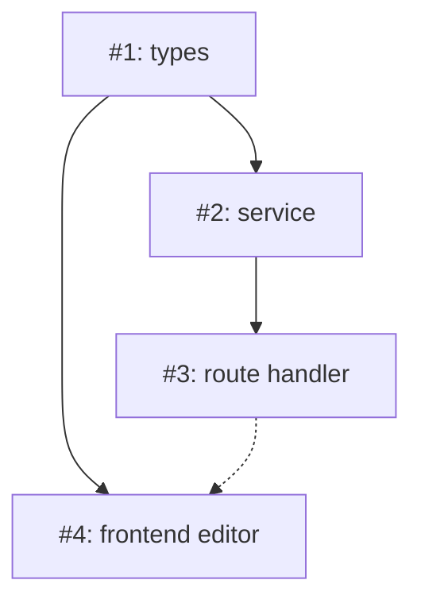

# Implementation Plan: [Feature Name]

## Context & Motivation

**Issue**: #<number> — <title>
**PRD**: [<slug>](../prds/<slug>.md)

[1-3 sentences: Why this work exists. What problem does it solve?]

## Scope

**In scope:**
- [Concrete deliverable 1]
- [Concrete deliverable 2]

**Out of scope:**
- [Explicit exclusion — prevents scope creep during implementation]

## Requirements Traceability

| Req ID | Description | Priority | Affected Files |
|--------|-------------|----------|----------------|
| REQ-001 | [From PRD functional requirements] | P0 | `path/to/file.ts` |
| REQ-002 | [From PRD functional requirements] | P1 | `path/to/other.ts` |

_Every file in the Change Manifest maps to at least one requirement. Every P0 requirement maps to at least one file._

## Change Manifest

| # | File | Action | Section / Function | Description | Reqs | Group | Status |
|---|------|--------|--------------------|-------------|------|-------|--------|
| 1 | `src/types/foo.ts` | modify | `FooConfig` interface | Add optional `bar: string` field to config type | REQ-001 | A | [ ] |
| 2 | `src/services/fooService.ts` | modify | `processFoo()` | Currently ignores bar. After: reads `config.bar`, validates non-empty, passes to `buildOutput()` | REQ-001 | A | [ ] |
| 3 | `src/routes/foo.ts` | modify | `POST /foo` handler | Add `bar` to request body schema validation (zod), pass to `processFoo()` | REQ-001 | A | [ ] |
| 4 | `src/components/FooEditor.tsx` | modify | `FooForm` component | Add `<TextField name="bar" label="Bar" />` to form, wire to form state | REQ-002 | B | [ ] |

_Action: `create` | `modify` | `delete`. Group: letter matching Execution Groups below. Status updated by `/root:impl`: `[ ]` pending, `[~]` in progress, `[x] (<sha>)` complete._

## Dependency Graph

_Solid arrows = hard dependency (must complete first). Dashed = soft dependency (can start, needs integration later). Numbers reference the Change Manifest._

## Execution Groups

### Group A: Backend
**Agent**: `specialist-backend` or `team-implementer`
**Changes**: #1, #2, #3
**Sequence**: Types (#1) → service (#2) → route (#3)
**Tests**: Create `src/services/__tests__/fooService.test.ts` — test `processFoo()` with bar present, absent, empty string, and invalid type

### Group B: Frontend
**Agent**: `specialist-frontend` or `team-implementer`
**Changes**: #4
**Depends on**: Group A completing #1 (types). Can start in parallel after #1.
**Tests**: Create `src/components/__tests__/FooEditor.test.tsx` — test bar field renders, submits value, validates required

_Groups execute in parallel where the dependency graph allows. Each group includes test requirements. `/root:impl` drives execution._

## Coding Standards Compliance

- [ ] [Standards from root.config.json → codingStandards]
- [ ] [Proactive cleanup: "While modifying X, fix existing Y"]

_Proactive items prevent future tech debt. Each must justify why it belongs in this plan._

## Risk Register

| Risk | Probability | Impact | Mitigation |
|------|-------------|--------|------------|
| [Breaking change to consumers] | Medium | High | Add field as optional with default |

## Verification Plan

- [ ] Lint + type-check passes (from root.config.json → validation.lintCommand)
- [ ] Unit tests for new code (from root.config.json → validation.testCommand)
- [ ] **Manual**: [Describe end-to-end scenario to verify]
- [ ] **Negative**: [Describe what should NOT work / regression check]

## Open Questions

_Remove this section entirely if none. Open questions block implementation — resolve before starting._

1. [Question that needs human input before proceeding]
